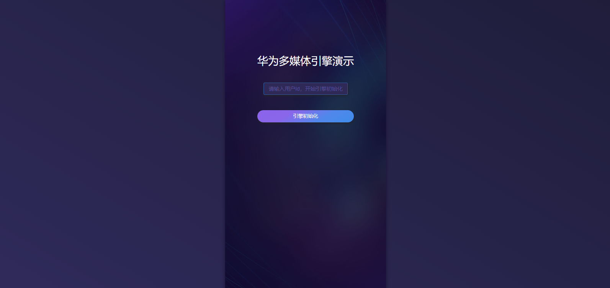

# Game Multimedia Service (Web)

## Contents<a name="section106mcpsimp"></a>

-   [Introduction](#section119mcpsimp)
-   [Environment Requirements](#section123mcpsimp)
-   [Development Preparations](#section126mcpsimp)
-   [Running Result](#section137mcpsimp)
-   [License](#section147mcpsimp)

## Introduction<a name="section119mcpsimp"></a>

The sample code demonstrates how to integrate Game Multimedia Service into your web game.

## Environment Requirements<a name="section123mcpsimp"></a>

You are advised to preview the sample code with a modern browser and use Node.js 14 or later to build the program.

## Development Preparations<a name="section126mcpsimp"></a>

1. Ensure that your local Node.js version is 14 or later.
2. Clone the code to the local, switch to the root directory of the project, and run the **npm install** command to install the project dependencies.
3. Register a [HUAWEI ID](https://developer.huawei.com/consumer/en/doc/start/registration-and-verification-0000001053628148).
4. Create an app and [configure the app information in AppGallery Connect](https://developer.huawei.com/consumer/en/doc/development/HMSCore-Guides/web-preparations-0000001050050891).
5. Download the **agconnect-services.json** file of your app from AppGallery Connect.
6. Find the following information in the downloaded JSON file and configure it in the **index.ts** file.

```ts
...
EngineParamsConfig.setAppId('xxx');
EngineParamsConfig.setClientId('xxx');
EngineParamsConfig.setClientSecret('xxx');
EngineParamsConfig.setGameSecret(''); // Configure this item only when security hardening is enabled.
...
```

7. Run the **npm run build** command to compile and package the files. The packages will be saved to the **dist** directory.
8. Run the sample program in the browser.

> You are advised to enable security hardening in the production environment and obtain the security signature from the server.


## Running Result<a name="section137mcpsimp"></a>

With the functions provided in the sample code, you will learn how to:

1. Initialize or destroy the multimedia engine.
2. Allow players to create or join a team room.
3. Allow players to create or join a national room.
4. Switch the chat room.
3. Allow players to mute themselves or a specified player.
4. Allow the room owner to mute a specified player or all players.



## License<a name="section147mcpsimp"></a>

The sample code is licensed under [Apache License 2.0](http://www.apache.org/licenses/LICENSE-2.0).
